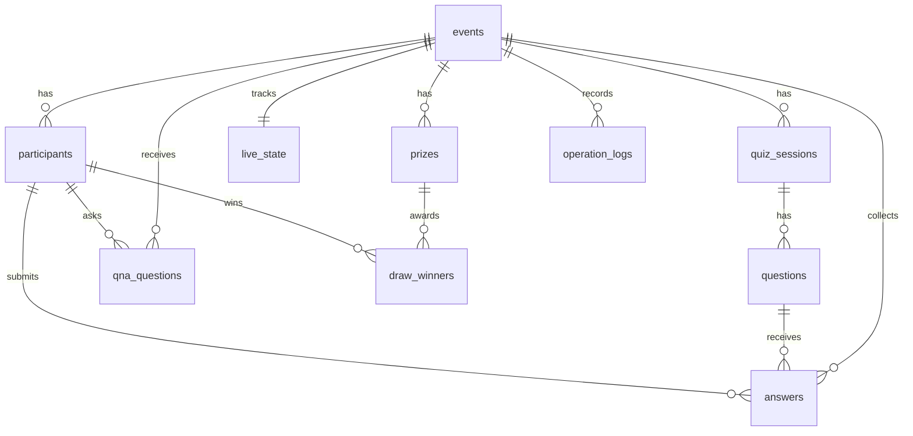

# Dorae Quiz Live Database Schema

This document describes the initial Supabase/PostgreSQL schema for the standalone `dorae-quiz-live` project.

This stage only defines the database shape, constraints, indexes, triggers, and Row Level Security direction. It does not connect to a Supabase project, create client/server SDK code, implement authentication, save participant registrations, or add realtime behavior.

## Migration File

- `supabase/migrations/001_initial_schema.sql`

The migration includes:

- `pgcrypto` extension for `gen_random_uuid()`
- Core event quiz tables
- Check constraints and unique constraints
- Query indexes for event operation and statistics
- Shared `updated_at` trigger function
- `answers.is_correct` trigger calculation from the stored answer key
- RLS enabled on every table
- Deny-by-default initial RLS stance with no permissive public policies yet

## Relationship Overview

## Table Roles

### `events`

Stores each live quiz event. `event_code` is the public code used in URLs such as `/e/[eventCode]` and `/screen/[eventCode]`.

Important fields:

- `title`, `subtitle`, `venue`: event display information
- `starts_at`, `ends_at`: schedule metadata
- `primary_color`, `logo_url`, `screen_notice`: branding and screen display settings
- `is_active`: allows an event to be hidden or disabled without deleting it

### `participants`

Stores participant registration data per event.

Important rules:

- `phone` stores the original input value.
- `phone_normalized` stores the duplicate-check value and is unique within the same event.
- `display_name` is optional. If it is empty, the application should display `name`.
- `phone` and `phone_normalized` are personally identifiable information and must never be exposed on projection screens, public participant views, or public realtime payloads.

Phone normalization rule:

- Trusted server-side code should normalize phone numbers before insert.
- At minimum, strip all non-numeric characters for local Korean numbers.
- If international participants are expected, normalize to one agreed international format, such as an E.164-style value.
- Do not trust client-side formatting for uniqueness. The server action or RPC must set `phone_normalized`.

### `quiz_sessions`

Groups questions for an event. A future event may have one main session or multiple sessions.

Allowed `status` values:

- `draft`
- `ready`
- `live`
- `ended`

### `questions`

Stores quiz questions and four fixed options.

Important rules:

- `correct_option` must be between `1` and `4`.
- `time_limit_seconds` must be between `5` and `300`.
- `order_index` controls display order within a session.

Security note:

- `correct_option` should not be sent to participant or screen clients until the operator reveals the answer.
- Participant screens must not query the raw `questions` table directly.
- Before answer reveal, `correct_option` must not appear in public responses, screen responses, or realtime payloads.
- A future `public_current_question` view or RPC should return only screen-safe fields such as question text, options, timer data, and reveal state.

### `answers`

Stores participant answers.

Important rules:

- `selected_option` must be between `1` and `4`.
- A participant can answer the same question only once.
- `is_correct` is calculated by a database trigger from `questions.correct_option` and `selected_option`.
- Indexes support per-question statistics, correctness summaries, participant lookups, and answer-time sorting.

Security note:

- Participant clients must never decide or submit trusted correctness.
- Even if a client sends an `is_correct` value, the trigger overwrites it on insert and update.
- Future answer submission should still happen through a server action or RPC so event timing, participant identity, and duplicate submission handling can be validated together.

### `live_state`

Stores the current live operation state for one event.

There is exactly one `live_state` row per event because `event_id` is unique.

Allowed `mode` values:

- `waiting`
- `question`
- `closed`
- `result`
- `draw`
- `qna`

Important fields:

- `current_session_id`
- `current_question_id`
- `question_started_at`
- `question_ends_at`
- `reveal_answer`
- `show_results`

### `qna_questions`

Stores audience questions.

Allowed `status` values:

- `pending`
- `approved`
- `hidden`
- `deleted`

Important security rule:

Participant questions must never appear on the screen immediately after submission. Only administrator-approved questions with `status = 'approved'` should be eligible for screen display.

### `prizes`

Stores prize definitions for each event.

Important fields:

- `name`
- `quantity`

`quantity` must be at least `1`.

### `draw_winners`

Stores draw results.

Allowed `source_type` values:

- `all_participants`
- `correct_answers`
- `question_correct_answers`

Important rule:

- The initial schema prevents the same participant from winning more than once in the same event.
- If a future option allows duplicate winners, replace the unique constraint on `(event_id, participant_id)` with a partial unique index or enforce that rule in draw logic.

### `operation_logs`

Stores important operator actions for audit and debugging.

Examples:

- event created
- live question started
- answer revealed
- winner drawn
- Q&A approved or hidden

`detail` is `jsonb` so each action can store contextual metadata without changing the table schema.

## Core Constraints

- `events.event_code` is unique and required.
- `participants` stores both original `phone` and server-normalized `phone_normalized`.
- `participants` prevents duplicate `phone_normalized` values within the same event.
- `quiz_sessions.status` is limited to `draft`, `ready`, `live`, `ended`.
- `questions.correct_option` is limited to `1` through `4`.
- `questions.time_limit_seconds` is limited to `5` through `300`.
- `answers.selected_option` is limited to `1` through `4`.
- `answers` prevents duplicate answers for the same participant and question.
- `answers.is_correct` is assigned by trigger rather than trusted from the client.
- `live_state.event_id` is unique, creating one state row per event.
- `live_state.mode` is limited to known screen/operator modes.
- `qna_questions.status` is limited to moderation states.
- `prizes.quantity` must be at least `1`.
- `draw_winners.source_type` is limited to known draw source modes.
- `draw_winners` prevents duplicate winners within the same event.

## Index Strategy

The migration adds indexes for the main expected access patterns:

- Event lookup by `event_code`, active state, and schedule
- Participant lookup by event, normalized phone uniqueness, and join time
- Quiz session lookup by event and status
- Question lookup by session, order, and active state
- Answer statistics by event, question, selected option, and correctness
- Live state lookup by current session and current question
- Q&A moderation by event, status, pinned state, and created time
- Prize and winner lookup by event
- Operation log lookup by event, admin user, action, and created time

## `updated_at` Trigger

The migration creates one shared trigger function:

- `public.set_updated_at()`

The function is attached to:

- `events`
- `participants`
- `quiz_sessions`
- `questions`
- `live_state`

These tables are expected to be updated during event setup or live operation.

## RLS Direction

RLS is enabled on every table in the initial migration.

No permissive public policies are created yet. This is intentional. With RLS enabled and no policies, Supabase API access is deny-by-default until authentication, participant session identity, and screen access design are finalized.

Future policies should separate access into three surfaces.

### 1. Participant Public Access

Participant-facing routes:

- `/e/[eventCode]`
- `/e/[eventCode]/join`
- `/e/[eventCode]/play`

Expected future access:

- Read limited public event metadata for active events.
- Insert a participant record after privacy consent.
- Submit one answer per question for the current participant.
- Submit Q&A questions as `pending`.

Security direction:

- Do not allow participant clients to select raw `participants` rows broadly.
- Do not allow participant clients to read `participants.phone` or `participants.phone_normalized`.
- Do not allow participant clients to query raw `questions` rows directly.
- Do not expose `questions.correct_option` before answer reveal.
- Do not trust participant clients to provide `answers.is_correct`.
- Prefer server actions or RPC functions for participant registration and answer submission, so validation can happen in one controlled path.

### 2. Screen Read Access

Screen-facing route:

- `/screen/[eventCode]`

Expected future access:

- Read active event display metadata.
- Read the event's `live_state`.
- Read the current question text and options through a screen-safe view or RPC.
- Read aggregated answer statistics, not raw answer rows.
- Read only approved Q&A questions.
- Read draw winner display names or masked names, never phone numbers.

Security direction:

- Use a dedicated screen token or controlled server route instead of broad anonymous table access.
- Expose a sanitized screen view or RPC response.
- Never include `participants.phone` or `participants.phone_normalized` in screen queries, views, subscriptions, or realtime payloads.
- Use `display_name` when present; otherwise use `name` or a masked name derived on the server.
- Only `qna_questions.status = 'approved'` rows are eligible for screen display.

### 3. Admin Access

Admin-facing routes:

- `/admin`
- `/admin/events`
- `/admin/events/[eventId]`
- `/admin/events/[eventId]/questions`
- `/admin/events/[eventId]/live`
- `/admin/events/[eventId]/draw`
- `/admin/events/[eventId]/qna`

Expected future access:

- Full event-scoped CRUD for events, sessions, questions, prizes, live state, Q&A moderation, draw winners, and operation logs.
- Read participant and answer data for operation and export.
- Read phone numbers only where operationally required.

Security direction:

- Add a real admin identity model before creating permissive admin policies.
- Possible options:
  - Supabase Auth with an `admin_users` table.
  - Supabase Auth with custom JWT claims.
  - Event-scoped admin membership if multiple operators manage different events.
- Log sensitive operator actions into `operation_logs`.

## Privacy Notes

`participants.phone` and `participants.phone_normalized` are sensitive personal data.

Rules for future implementation:

- Only administrators should be allowed to read phone numbers.
- Only trusted server code should write `phone_normalized`.
- Public participant views should not read other participant records.
- Screen views must never display or transmit phone numbers.
- Realtime channels must avoid broadcasting full participant rows.
- Winner and ranking displays should use `display_name` when present, otherwise `name`.
- If exports are added later, they should be admin-only and audited through `operation_logs`.

## Screen-Safe View or RPC Direction

Future screen responses should be built from explicit screen-safe views or RPC functions rather than direct table access.

Recommended future surfaces:

- `public_current_question(event_code)` or a similarly named RPC for the current display question.
- `public_answer_summary(event_code, question_id)` for aggregated option counts and percentages.
- `public_screen_qna(event_code)` for approved and pinned Q&A only.
- `public_draw_winners(event_code)` for winner names with no phone data.

These surfaces should:

- Never include `participants.phone`.
- Never include `participants.phone_normalized`.
- Never include `questions.correct_option` before answer reveal.
- Return participant names as `display_name`, fallback `name`, or a server-masked value.
- Return only `qna_questions.status = 'approved'` rows for projection.
- Return aggregated answer statistics instead of raw `answers` rows whenever possible.

## Not Implemented Yet

This stage does not implement:

- Supabase project connection
- Environment variables
- Supabase client/server helpers
- Authentication
- Admin user model
- Participant registration saving
- Answer submission logic
- Realtime subscriptions
- Screen token or screen-safe views
- RPC functions
- Edge Functions
- Storage policies for logos
- Data seed files

## Suggested Next Step

The next stage should define the application access model before adding Supabase code:

1. Choose admin authentication strategy.
2. Decide whether screen access uses a signed token, server-rendered route, or RPC.
3. Decide how participant identity is stored after join.
4. Add server actions or route handlers for participant join, answer submit, and Q&A submit.
5. Add read-safe views or RPC functions for screen projection.
6. Add concrete RLS policies only after those access paths are decided.
